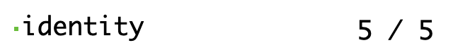
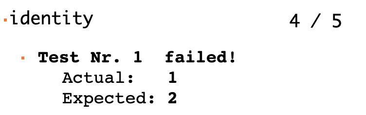

# Test-Framework

## Beschreibung

Um die Korrektheit unserer Konstruktionen zu verifizieren haben, wir ein eigenes Test Framework ohne externe Abhängikeiten geschrieben. Von der Architektur \(Aufbau/Struktur & Konzept\) haben wir uns vom Test Framework von Prof. Dierk König inspieren lassen. Ausserdem wurde der [Immutable-Stack](immutable-stack.md#beschreibung) im Test-Framework eingebaut und verwendet. Zudem sind mehrere nützliche Funktionen vom Stack verwendet worden,  wie z.b die [Filter](immutable-stack.md#filter)- & [forEach](immutable-stack.md#foreach-loop)-Funktion.

### Ansicht aller Testergebnissen: [AllTest.html](https://mattwolf-corporation.github.io/lambdaCalculusGithubPages/test/allTest.html)

## Aufbau

Zuerst ein paar wichtige Definition/Erklärungen zum Test-Framework.

Die kleinste Einheit unseres Test-Frameworks ist ein einzelner Aufruf der equals-Methode auf dem Assert Objekt.

```javascript
assert.equals(1, 1);
```

Die equals-Methode nimmt zwei Parameter entgegen. Das erste Argument ist der tatsächliche Wert \(z.b der Wert vom Aufruf, einer zu testenden Funktion\). Der zweite Parameter ist der erwartete Wert. Nun vergleicht die equals-Funktion die beiden übergebenen Parameter auf Gleicheit. Wenn der erwartete Wert mit dem IST-Zustand übereinstimmt, so ist der Test erfolgreich.

Pro Konstruktion/Funktion gibt es mehrere solche Test's mit der equals-Methode. Diese werden dann zu einem Testfall für die Funktion zusammengefasst.

Beispiel eines Testfalles:

```javascript
lambdaCTest.add("identity", assert => {
    assert.equals(id(1), 1);
    assert.equals(id(n1), n1);
    assert.equals(id(true), true);
    assert.equals(id(id), id);
    assert.equals(id === id, true);
});
```

Bei diesem Testfall wird die [Identitätsfunktion](einfache-kombinatoren.md#id-die-identitaetsfunktion) getestet. Der Testfall besteht hier aus 5 Tests.

Mehrer zusammengehörende Testfälle werden einer Testsuite hinzugefügt. Dies dient dazu um mehrere Testfälle zu gruppieren. Zum Beispiel werden alle Testfälle vom Stack einer Testsuite hinzugefügt.


In der Testsuite befinden Testfälle von allen Funktionen des Gruppierten Thema's\(Im Bild oben alle Testfälle von allen Stack-Konstruktionen\). Dabei sieht man bei einem einzelnen Testfall einer Funktion, wie viele Test's erfolgreich waren.



Wenn in einem Testfall ein Test fehlschlägt, wird dies farblich angezeigt. Dabei wird die Nummer des Test's und was genau schiefgegangen ist angezeigt.



Die Testsuiten werden am Schluss auf einer Html Seite angezeigt, sodass man eine Übersicht von allen Test's hat. Auf dieser Übersicht werden alle Test's von allen Testfällen zusammengezählt und als Total angezeigt.


